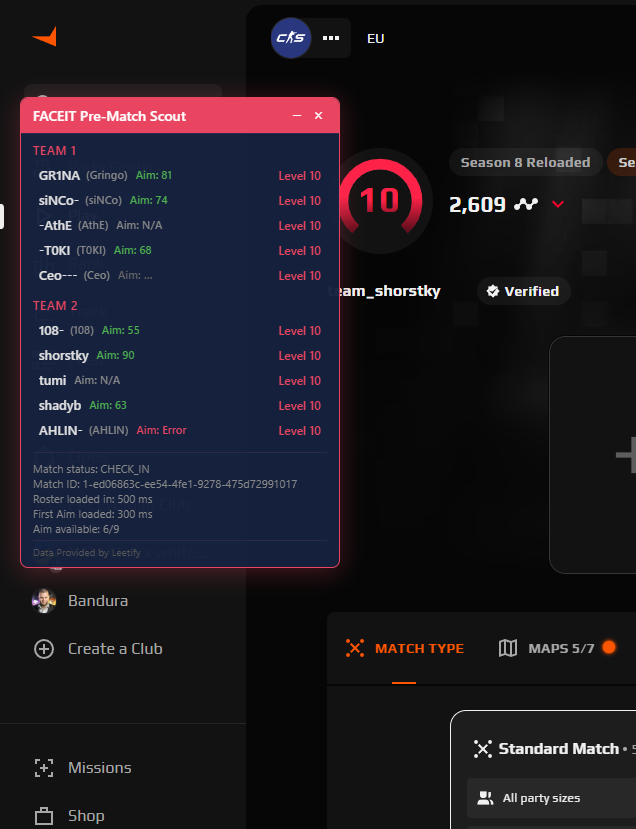

# FACEIT Pre-Match Scout

Chrome extension (Manifest V3) that reveals FACEIT match rosters, Aim Ratings, and player stats **before** clicking Accept.



---

## Features

### Roster reveal before Accept
- Detects `matchId` from FACEIT network requests when the ready-check appears
- Fetches full 5+5 roster via official [FACEIT Data API](https://developers.faceit.com/docs)
- Overlay appears while the Accept button is still visible — you decide when to click

### Leetify Aim Rating
- For each player: Aim Rating from [Leetify Public CS API](https://api-public-docs.cs-prod.leetify.com)
- `Aim: 81` — available  |  `Aim: …` — loading  |  `Aim: N/A` — private/not registered  |  `Aim: Error` — fetch failed
- Data loads progressively — roster shows immediately, aim values fill in as they arrive

### FACEIT lifetime stats
- K/D ratio, K/R ratio, win rate, headshot %, total matches
- Sourced from FACEIT Data API (`/data/v4/players/{id}/stats/cs2`)
- Displayed in each player's expanded details panel

### Overlay UI
- **Draggable** — grab the red header bar to reposition
- **Collapsible** — click `−` to minimize, `+` to expand
- **Expandable player rows** — click any player to see SteamID64, FACEIT ID, membership, match stats
- **Shadow DOM** — fully isolated from FACEIT page CSS, zero style conflicts
- **z-index max** — always on top of the ready-check modal, never blocks the Accept button

### Extension popup
- Live status: Waiting / Match detected / Loading / Roster ready / Error
- API key status (FACEIT + Leetify configured/missing)
- Match ID, players loaded, match status
- Preview overlay button (test with mock data, no match needed)
- Clear overlay button

### Options page
- FACEIT API key (with test button)
- Leetify API key (with test button)
- Toggles: Enable overlay, Enable Aim Rating, Show Steam name, Show FACEIT level, Show membership, Show technical IDs

### Privacy & security
- API keys stored in `chrome.storage.local`, never sent to content script
- No cookie access, no `chrome.debugger`, no `webRequestBlocking`
- No data persisted to external servers
- Leetify match data not cached to storage

---

## Screenshots

### Overlay with roster + Aim Ratings + expanded player stats


### Extension popup
> _Right-click extension icon → inspect popup, or just click the icon_

### Options page
> _Right-click extension icon → Options, or open from popup_

---

## Installation

### Prerequisites
- [Node.js 20+](https://nodejs.org/)
- Google Chrome (stable)

### Build from source

```bash
# 1. Clone the repo
git clone <repo-url> fve
cd fve

# 2. Install & test core package
cd packages/core
npm install
npm test          # should show 46/46 pass
cd ../..

# 3. Install & build extension
cd extension
npm install
npm run build     # outputs to extension/dist/
cd ..
```

### Load in Chrome

1. Open `chrome://extensions`
2. Enable **Developer mode** (toggle top-right)
3. Click **Load unpacked**
4. Select the `extension/dist` folder
5. The extension icon appears in your toolbar

### Reload after changes

After rebuilding (`npm run build` in `extension/`), click the refresh icon on the extension card in `chrome://extensions`.

---

## API Keys

You need two API keys (both free):

### FACEIT Data API key
1. Go to [developers.faceit.com](https://developers.faceit.com)
2. Sign in with your FACEIT account
3. Create a new application / get your API key
4. Paste it in **Options → FACEIT API Key**
5. Click **Test FACEIT key**

### Leetify API key (optional — for Aim Rating)
1. Go to [leetify.com/app/developer](https://leetify.com/app/developer)
2. Sign in with Steam
3. Generate an API key
4. Paste it in **Options → Leetify API Key**
5. Click **Test Leetify key**

> You can use the extension without a Leetify key — you'll still get the roster and FACEIT stats. Only Aim Rating requires Leetify.

---

## Usage

### Real match flow

1. Open [faceit.com](https://www.faceit.com) and start FACEIT Anti-Cheat
2. Enter CS2 matchmaking → click **Find Match**
3. When the ready-check appears (Accept button visible):
   - Extension detects the `matchId` automatically
   - Overlay appears with both team rosters
   - Aim Ratings and stats load progressively
4. Review the info, then click **Accept** before the timer expires

### Preview (no match needed)

1. Open any page on `faceit.com`
2. Click the extension icon
3. Click **Preview overlay**
4. Mock data with both teams, Aim Ratings, and stats appears
5. Click **Clear overlay** to dismiss

---

## How it works

```
FACEIT ready-check
  → chrome.webRequest detects match/checkin API call
  → extract matchId (1-xxxxxxxx-...)
  → GET /data/v4/matches/{matchId}        (FACEIT Data API)
  → parse teams.faction1.roster + faction2.roster
  → overlay renders immediately (5+5 names, levels)

  → parallel: GET /v3/profile?steam64_id=...  (Leetify, ×10 players, concurrency=4)
  → parallel: GET /data/v4/players/{id}/stats/cs2  (FACEIT, ×10 players)
  → overlay updates progressively as each response arrives
```

### Data sources

| Data | Source | Endpoint |
|------|--------|----------|
| Match roster (nickname, level, SteamID64) | FACEIT Data API | `/data/v4/matches/{matchId}` |
| Aim Rating | Leetify Public CS API | `/v3/profile?steam64_id=` |
| K/D, K/R, win rate, matches | FACEIT Data API | `/data/v4/players/{id}/stats/cs2` |

### State machine

```
idle → match-detected → loading → ready
                             ↘ partial
                             ↘ error
```

### Retry strategy (FACEIT)

- Immediate request
- Retry after 500 ms
- Retry after 1500 ms
- Stop (no infinite polling)

Retries only for: `404`, timeout, `5xx`. Auth errors (`401`/`403`) and rate limits (`429`) stop immediately.

### Concurrency (Leetify + FACEIT stats)

- Max 4 concurrent requests
- Each player gets Aim Rating first, then FACEIT stats
- Results stream in progressively — no waiting for all to finish
- `AbortController` cancels all in-flight requests when a new match is detected

---

## Project structure

```
packages/core/           Shared TypeScript logic (46 unit tests)
├── src/
│   ├── match-id.ts      matchId extraction regex (1- prefix required)
│   ├── faceit-client.ts FACEIT Data API client + player stats
│   ├── leetify-client.ts Leetify API client (Aim Rating, key validation)
│   ├── roster.ts        Roster parsing (teams.faction1/faction2)
│   ├── types.ts         FaceitPlayer, AimRatingState, MatchScoutState, MatchStats
│   └── index.ts         Barrel exports
├── package.json
└── tsconfig.json

extension/               Chrome Extension (Manifest V3)
├── src/
│   ├── background/      Service worker
│   │   ├── index.ts         Entry: wires detection → loading → broadcast
│   │   ├── match-detector.ts webRequest listener for match/checkin URLs
│   │   ├── match-loader.ts  FACEIT Data API with bounded retries
│   │   ├── leetify-loader.ts Leetify + FACEIT stats with concurrency queue
│   │   └── state.ts         MatchScoutState machine
│   ├── content/         Content script (injected into faceit.com)
│   │   ├── index.tsx        Shadow DOM mount + message listener
│   │   ├── Overlay.tsx      Draggable/collapsible panel
│   │   ├── TeamSection.tsx  One faction's roster
│   │   ├── PlayerRow.tsx    Single player row + expandable details
│   │   └── overlay.css
│   ├── popup/Popup.tsx   Extension popup (status, preview, clear)
│   ├── options/Options.tsx API keys, toggles, test buttons
│   └── shared/          Message types, ScoutOptions
├── public/
│   ├── manifest.json    MV3 manifest
│   ├── popup.html
│   └── options.html
├── build.mjs            esbuild bundler (IIFE for each entry point)
├── package.json
└── dist/                ← Load this folder in Chrome
```

---

## Development

```bash
# Core package
cd packages/core
npm test          # 46 unit tests
npm run typecheck

# Extension
cd extension
npm run build     # bundle with esbuild
npm run typecheck
```

### Adding features

1. Add/modify logic in `packages/core/src/`
2. Add tests in `packages/core/src/*.test.ts`
3. Update extension files in `extension/src/`
4. `npm test` in core, `npm run build` in extension
5. Reload extension in `chrome://extensions`

---

## CDP Investigator (research tool)

The original tool that proved CASE_A: roster is available via Data API before Accept.

```bash
npm install
./scripts/start-chrome.sh     # or .ps1 on Windows
npm run start
```

Queue for a match and use CLI markers:
- `[1]` Queue started
- `[2]` Match found
- `[3]` Ready check visible
- `[4]` Accepted
- `[5]` Opponents revealed
- `[6]` Match room loaded
- `/` or `stop` — Stop and generate report

## Requirements

- Node.js 20+
- Google Chrome (stable)
- Windows, macOS, or Linux

